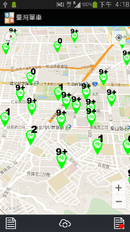
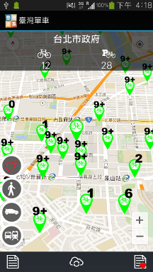
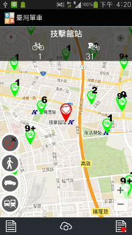

TaiwanBike
==========
info about Taiwan Taipei and Kaohsiung public bike
(on going on Freeman_working branch)

##ScreenShot
Public bicycle system of Taipei and Kaohsiung of Taiwan.

real time number on govertment's open-date server(rentable count)

Bicycle station details, rentable count, parking space count. And it can guide you to the destination by feet, driving or public transport.

You can add a station to favor list.

##LICENSE
